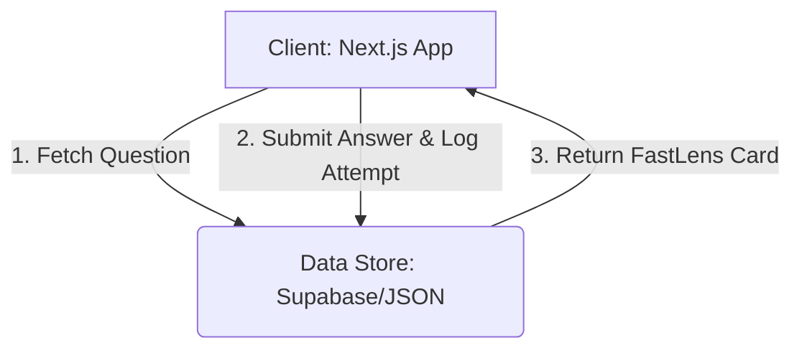
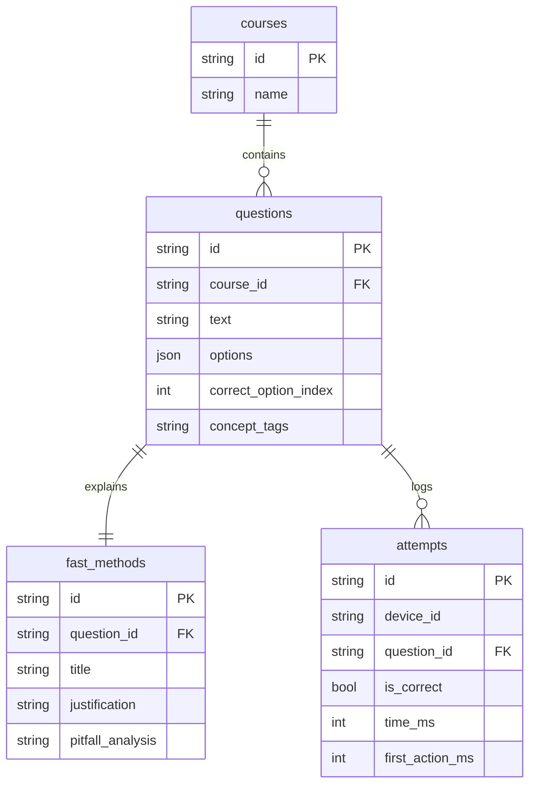
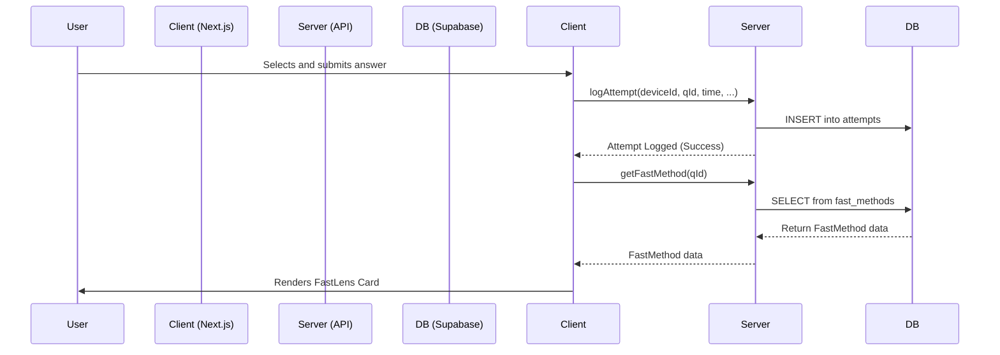

# CognoPath: FastLens MVP - Project Overview

## 1. Executive Summary

CognoPath is a learning platform designed to make students faster and more accurate in competitive, time-bound exams. Our standalone MVP, **FastLens**, is a web-based practice tool built with Next.js that targets this mission's core. FastLens is for students preparing for board and competitive exams who struggle with time management. It solves the critical problem of not just knowing the answer, but knowing the *fastest way* to find it. After every question a user attempts, we immediately display a "FastLens card" that teaches the most efficient, safe method to solve that specific problem. This unique, post-answer feedback loop on speed and strategy is our core differentiator, moving beyond simple right/wrong feedback to build true test-taking mastery.

## 2. Problem & Outcomes

In high-stakes exams, speed is as important as accuracy. Students often learn correct but time-consuming methods, leaving them unable to complete papers and losing critical marks. Explanations focus on "how" but rarely on "how fast."

**Success Outcomes:**
*   **Time-to-Correct-Answer:** Reduce the average time taken for a correct answer by 20% after one month of consistent use.
*   **Accuracy:** Increase overall accuracy by 10-15% as students master faster, less error-prone methods.
*   **Retention & Confidence:** Users return for >3 sessions a week, demonstrating trust in the methods and a measurable improvement in their practice scores.

## 3. Users & Use Cases

**Target Segments:**
*   **MVP Focus:** Students preparing for Indian Board Exams: Class 10, 11, and 13 Chemistry.
*   **Future Expansion:** Competitive exam aspirants (JEE, NEET) and government job exam candidates.

**Use Cases:**
*   **Primary:** A student actively practices a chapter for an upcoming exam, learning faster techniques with each question to improve their speed.
*   **Secondary:** A student revisits a weak topic to quickly review the most effective shortcuts and problem-solving patterns.

## 4. Core Value & USP

Our core value is the **FastLens Card**, which provides immediate, contextual feedback on problem-solving speed and efficiency.

*   **The "Fastest Safe Method":** This is our unique selling proposition. It's not just a hint or rephrased text; it's a vetted, genuinely shorter logical path to the correct answer.
*   **Guardrails for Trust:** We explicitly handle cases where no reliable shortcut exists by showing a **"No Safe Shortcut"** message. This prevents dangerous advice and builds user trust. We teach strategy, not just tricks.

## 5. Scope (MVP vs. Next)

**MVP Scope (FastLens):**
*   **Pages:** Public Landing Page (`/`), Core Practice Engine (`/practice`), Simple Content Editor (`/admin?secret=...`).
*   **Core Loop:**
    1.  User answers a question.
    2.  Log the attempt (correctness, time, first-action time).
    3.  Display the FastLens card (fastest method, justification, common pitfalls).
*   **Content:** Seeded with public courses for Class 10, 11, 13 Chemistry.
*   **Intelligence:** "Adaptive-lite" algorithm for question selection (no repeats, mix difficulty, focus on weak spots).
*   **Tech:** No user authentication. Anonymous sessions are tracked via `deviceId` in `localStorage`.

**"Next" (Post-MVP):**
*   Richer adaptive models and blind-spot mapping.
*   User accounts (SSO), progress dashboards, and performance history.
*   Confidence level tracking and calibration.
*   Expansion to more subjects (Physics, Math) and exams.

## 6. System Overview

The system consists of a web client that fetches questions from a data store, logs user attempts back to that store, and then retrieves the relevant "fast method" for display.



*(Note: Parallel Android development will consume the same data contracts from the Data Store, ensuring a unified content source.)*

## 7. Architecture (Web MVP)

*   **Tech Stack:** Next.js 14 (App Router), TypeScript, Tailwind CSS, shadcn/ui.
*   **Component Boundaries:**
    *   `LandingPage`: Marketing content, trust avatars, CTA.
    *   `PracticeEngine`: Manages session state, question flow.
    *   `QuestionCard`: Displays the current question and options.
    *   `FastLensDisplay`: Renders the fast method card post-answer.
    *   `AdminPortal`: Simple forms for CRUD operations on courses and questions.
*   **State Management:** React Server Components for data fetching. Client-side state (`useState`, `useContext`) for the active practice session.
*   **Data Access:** Next.js Server Actions to communicate with Supabase (or read from a local JSON file as a fallback).
*   **Rendering:** Question and explanation content will be rendered from Markdown using a library like `react-markdown`.
*   **Analytics:** Log key events (e.g., `attempt_made`) to a simple backend endpoint or Vercel Analytics.

## 8. Data Model

Four main tables define our data structure.



**Example Data:**
*   **courses:** `{ id: "chem10", name: "Class 10 Chemistry" }`
*   **questions:** `{ id: "q1", course_id: "chem10", text: "What is the pH of a neutral solution?", options: ["<7", "7", ">7"], correct_option_index: 1, concept_tags: "acids-bases" }`
*   **fast_methods:** `{ id: "fm1", question_id: "q1", title: "Keyword association", justification: "The word 'neutral' directly maps to pH 7. No calculation needed.", ... }`
*   **attempts:** `{ id: "a1", device_id: "xyz", question_id: "q1", is_correct: true, time_ms: 1500, ... }`

## 9. Algorithms

**1. Adaptive-lite Question Selector:**
A stateful queue on the client that selects the next question based on a weighted score:
*   **Penalty Weight:** High weight for recent incorrect answers on a specific `concept_tag`.
*   **Speed Weight:** Medium weight for concepts where the user is correct but slow.
*   **Recency Filter:** Exclude questions shown in the last N attempts to avoid repetition.
*   **Difficulty Mix:** Cycle through easy/medium/hard tags to maintain engagement.

**2. FastLens Logic:**
*   After an attempt, query for a `fast_method` where `question_id` matches the current question.
*   **Fallback:** If no entry is found, render the "No Safe Shortcut" variant of the FastLens card.
*   **Future:** Use LLMs to *generate drafts* of fast methods for new questions, which are then queued for mandatory human SME review and approval before becoming active.

## 10. UX Guidelines

*   **Font:** Inter.
*   **Color Palette:** Brand Primary: `#B995FF`. All text (headings, body, buttons) is **black (`#000000`)** for maximum readability and focus.
*   **Layouts:** Mobile-first, clean, and spacious. The practice screen must be distraction-free.
*   **Trust Signals:** Use testimonials/avatars "below the fold" on the landing page to build credibility without cluttering the initial view.

## 11. Telemetry & KPIs

**Events to Track:**
*   `practice_session_started`
*   `question_attempted` (props: `question_id`, `is_correct`, `time_ms`, `first_action_ms`, `concept_tags`)
*   `fast_lens_card_viewed`

**Key Performance Indicators (KPIs):**
*   **Efficacy:** % improvement in time-to-correct, % improvement in accuracy per concept.
*   **Engagement:** Sessions per week, Number of questions attempted per session.
*   **Retention:** D1/D7/D30 user retention.

## 12. Quality & Guardrails

*   **Content Accuracy:** All questions and fast methods require sign-off from a subject matter expert (SME) before going live.
*   **Shortcut Safety:** A clear policy against "trick" shortcuts that are not broadly applicable or safe.
*   **Error Handling:** The app will gracefully handle API errors or missing data without crashing.

## 13. Roadmap & Milestones (8 Weeks)

*   **Weeks 1-2:** Project Setup, Data Model & Supabase Schema, Landing Page UI, Admin Editor MVP.
*   **Weeks 3-4:** Core Practice UI, Question Loading & Answer Submission Flow.
*   **Weeks 5-6:** Implement FastLens Card Display Logic, Seed Chemistry Content.
*   **Weeks 7-8:** Implement Adaptive-lite Algorithm, E2E Testing, Analytics Integration, Internal Demo.

## 14. Risks & Mitigations

*   **Risk:** Low-quality or incorrect fast methods erode user trust.
    *   **Mitigation:** Mandatory SME review process for all content. No exceptions.
*   **Risk:** Content creation is a bottleneck.
    *   **Mitigation:** Post-MVP, develop an LLM-assisted workflow to speed up content generation for SME review.
*   **Risk:** Users don't perceive "speed" as a valuable enough differentiator.
    *   **Mitigation:** Frame all marketing and in-app stats around how speed directly translates to higher scores.

## 15. Open Questions

*   What is our long-term, scalable strategy for sourcing high-quality content?
*   Which analytics vendor (e.g., PostHog, Mixpanel) should we choose for deeper funnel analysis post-MVP?
*   What is the data-driven process for prioritizing the next subject for expansion?
*   What is our initial SEO strategy for organic growth?

## 16. Appendix

**A1. Sequence Diagram: Answer Submission**


**A2. Minimal API Contracts (TypeScript)**
```typescript
interface Question {
  id: string;
  text: string;
  options: string[];
  correctOptionIndex: number;
  conceptTags: string[];
}

interface Attempt {
  deviceId: string;
  questionId: string;
  isCorrect: boolean;
  timeMs: number;
  firstActionMs: number;
}

interface FastMethod {
  id: string;
  questionId: string;
  title: string;
  justification: string; // Supports Markdown
  pitfallAnalysis: string; // Supports Markdown
}
```

**A3. MVP Release - Acceptance Checklist**
- [ ] Landing page is live and mobile-responsive.
- [ ] Users can start a practice session for any seeded course.
- [ ] The entire practice loop is functional: answer -> log attempt -> see FastLens card.
- [ ] Attempts are correctly logged in the database.
- [ ] The "No Safe Shortcut" message displays correctly for questions without a fast method.
- [ ] Admin can create, update, and delete a question.
- [ ] Basic analytics for question attempts are being captured.
```